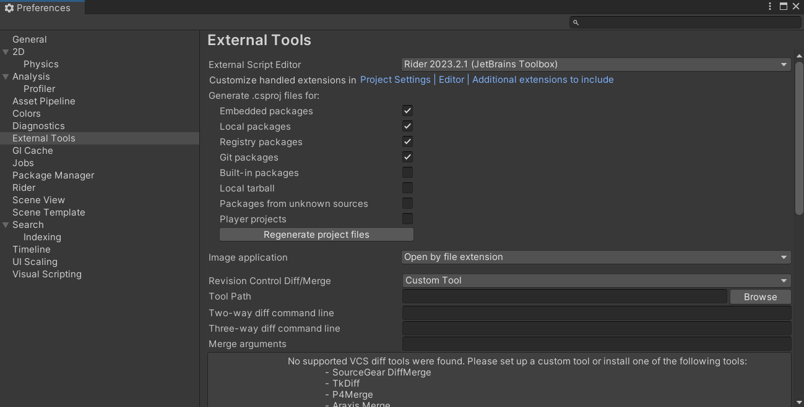

# WireBender3D

**Description:** Currently, creating wire-bent structures for large-scale manufacturing requires users to code in order to visualize and render their designs. This process can often be intimidating and/or inaccessible to many users. Our goal is to simplify the process of creating wire-bent structures by designing a workflow that empowers users to design their wire bends visually. We find our project idea instrumental in making wire bending more accessible to a wider audience. While there exist solutions that offer a somewhat visual workflow, none are specifically tailored to wire bending, nor do they provide feedback on the feasibility/manufacturability of the design. We are excited about working on a wire bending automation software due to its wide-ranging applications, spanning jewelry making, eyeglass frame development, orthodontic equipment, motorbikes/bicycle parts, office furnishing, gym equipment, etc.

https://github.com/bisson2000/INFO5380-HW2/assets/143034234/9caadadd-9600-4fb4-94e8-956ec2ffa540

**Summary of our keyboard shortcuts:** 

- **Adding line:** `L` (lowercase)
    - If you have a line segment selected and you want to increase the line: `Shift +  L` 
    - If you have a line segment selected and you want to retract the line: `Del +  L`
- **Adding curve:** `C` (lowercase)
    - If you have a curve segment selected and you want to increase the line: `Shift + C`
    - If you have a curve segment selected and you want to retract the line: `Del + C`
- **Rotate:** 
    - Clockwise: `R` (lowercase)
    - Counterclockwise: `Shift + R`
- **Increase or decrease the radius (e.g., arc) of a curve segment:** 
    - Increase: `K` (lowercase)
    - Loosen: `J` (lowercase)
- **Toggle length, bend, angle: `i`**
- **Erase:** `Backspace` 
- **Next segment selection: `↑`**
    - **Previous segment: `↓`**
- **Show collisions (simulation): `M`** (lowercase)
- Save: `Shift + P`  to save coordinates to a CSV file. 
    - Note when running the executable file (not in Unity):
        - For Windows users, the `Coordinates.csv` file will save to the following path (relative to the Windows Build parent folder):
            - `.\WireBender_Windows_Build\WireBender3D_Data\Output\Coordinates.csv`
        - For Mac users, the Coordinates.csv file will save to the following path (relative to the Windows Build parent folder):
            - `.\WireBender_Mac_AppleM-chip.app\Contents\Resources\Output\Coordinates.csv`
- **Toggle (Minimize/Expand) Bendscript Editor:** Tab
- **Orbit:**
    - **Trackpad:** `ctrl + Right Clic + Movement` (Windows) or `cmd + Right Clic + Movement` (Mac)\
    - **Mouse:** `Right Click + Movement`
- **Pan:**
    - **Trackpad:** `ctrl + Left Clic + Movement` (Windows) or `cmd + Left Clic + Movement` (Mac)\
    - **Mouse:** `Wheel Click + Movement`


## Cloning the repository
```
git clone git@github.com:bisson2000/INFO5380-HW2.git
```


## How to get started

Requirements:
- Unity 2022.3.7f1

Steps:
1. Clone the project
2. Open the project in Unity 2022.3.7f1
3. In Assets/Scenes, open MainMenu.unity
4. Click Play

## Hotkeys

- Adding line: L (lowercase)
    - If you have a line segment selected and you want to increase the line shift + L 
    - If you have a line segment selected and you want to retract the line del + l 
- Adding curve: C (lowercase)
    - If you have a line segment selected and you want to increase the line shift + L
    - If you have a line segment selected and you want to retract the line del + c
- Rotate clockwise: R
- Counterclockwise: shift + R
- Tighten the curvature (increase or decrease the radius of rotation): k
- Loosen: J
- Toggle length, bend, angle: i
- Erase: backspace 
- Next segment selection: ↑ (Arrow up)
- Previous segment: ↓ (Arrow down)
- Show collisions: M
- Save: Shift + P  to save coordinates to CSV


## How to start developing

First, clone the repository. Follow the following guides.

### Installing Unity Hub and Unity

1. Install Unity Hub [https://unity.com/download#how-get-started](https://unity.com/download#how-get-started)
    - Note: that Unity Hub allows for managing unity versions
2. Install Unity 2022.3.7f1 [unityhub://2022.3.7f1/b16b3b16c7a0](unityhub://2022.3.7f1/b16b3b16c7a0)
    - Note: If the direct link does not work, you can go to [https://unity.com/releases/editor/whats-new/2022.3.7](https://unity.com/releases/editor/whats-new/2022.3.7) and select "Install this version with Unity Hub"
3. In the installation menu, make sure the following is selected:
    1. Android build support
    2. iOS build support
    3. Mac build support (Mono)
    4. Documentation
4. Proceed to install unity

Note: You may need to restart your computer.

### Code editors recommendations

- Recommendation 1: JetBrains Rider (https://www.jetbrains.com/rider/)[https://www.jetbrains.com/rider/]
    - Note that an educational license is available
- Recommendation 2: Visual Studio Code
- Recommendation 3: Visual Studio Community

### Opening the project

1. In Unity Hub, select "Add" to add the project.
2. Select the "WireBender3D" folder in the repository, and click open.
3. Make sure the project editor version is 2022.3.7f1 in Unity Hub
4. Click on the "WireBender3D" project in Unity Hub to open it.


### Setting your code editor in the project

1. Go to Edit > Preferences (macOS: Unity > Settings)
2. Go to External tools
3. Set your external script editor to whichever one you prefer
4. Make sure the 4 first checkboxes are checked



### Opening the code from Unity

1. Go to Assets > Open C# Project


